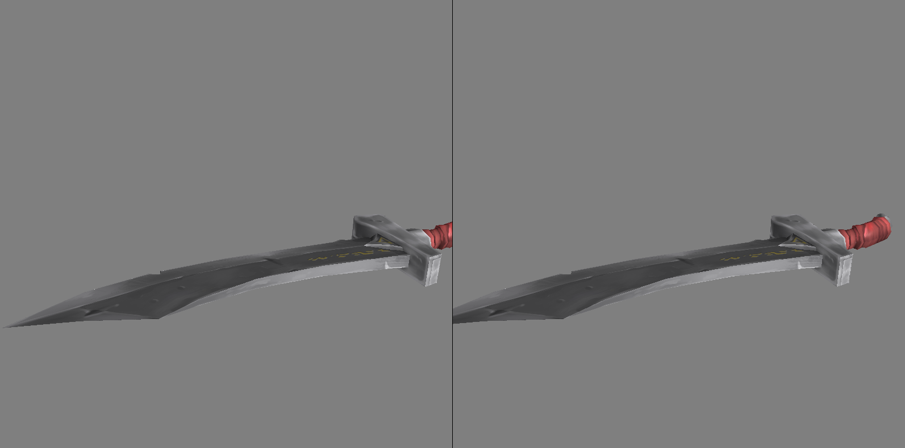

# Stereoscopic Renderer

A simple 3D stereoscopic renderer made with OpenGL for UW CSE 455 to explore human vision and stereoscopic vision.

## Presentation

TODO

## Problem Description

The project aims to simulate human vision through a stereoscopic perspective
projection renderer using OpenGL and C++. By implementing two cameras positioned
slightly apart, the renderer mimics the way human eyes perceive depth through
parallax. This allows users to view the 3D scene from two slightly different
positions, resulting in a stereoscopic effect when the left and right camera
views are displayed side by side. The renderer utilizes a game loop that
processes keyboard input (WASD, CTRL, and SPACE) to allow users to move around
and explore the 3D environment freely. Users can also rotate the camera by left
clicking and dragging the mouse.

## Project Setup

If you would like to run the project locally, we recommend using Visual Studio
2019 with desktop development for C++ installed. All other dependencies are
included in the repository. Disclaimer: We have only used Windows to run our
project, so success using macOS or linux is not guaranteed.

## Previous Work

To learn OpenGL, we followed [Victor Gordan’s OpenGL
Tutorials](https://www.youtube.com/playlist?list=PLPaoO-vpZnumdcb4tZc4x5Q-v7CkrQ6M-).
These tutorials helped us figure out how to organize our project and load glTF
models. To test our renderer, we used glTF models found on SketchFab. We also
relied on the following dependencies:
- `GLFW`: A library for window and OpenGL context management.
- `glad`: Loads OpenGL function pointers to be used from C++.
- `glm`: A math library for OpenGL, providing math primitives such as vectors,
matrices, and quaternions.
- Niels Lohman’s C++ `json` library: Used for loading glTF models.
- `stb`: C++ image library used for loading textures.

## Approach

We first implemented some abstractions to wrap the necessary OpenGL function
calls, such as `Shader`s, `Texture`s, `Mesh`es, `Model`s, and `Camera`s. We then
implemented a `StereoCamera`, which controls two basic `Camera`s that are offset
by a distance called the interpupillary distance (IPD). The first camera renders
the left side of the window, while the second camera renders the right side of
the window.

To render a model in our scene, we multiplied each vertex position $\mathbf{v}$
by a series of $4 \times 4$ matrices as follows:
$$
A_\text{projection} \cdot A_\text{view} \cdot A_\text{model} \cdot \mathbf{v},
$$
where
- $A_\text{projection}$ is the camera’s projection matrix, which projects 3D
  points to screen coordinates. It takes into account the field of view, the
  camera’s aspect ratio, and the near and far clipping planes.
- $A_\text{view}$ is the camera’s view matrix, which applies the transformation
  corresponding to the camera’s position and orientation.
- $A_\text{mode}$ applies the transformation corresponding to the vertex’s
  position and orientation.

We followed Victor Gordan’s OpenGL tutorials to implement a glTF model loader to
test our renderer. glTF is a standard for encoding 3D models and scenes managed
by The Khronos Group. While our model loader is not an exhaustive glTF loader,
it supports enough features for us to try out some models.

For the shading, we utilize the Blinn-Phong illumination model, a widely used
shading model in computer graphics that provides a realistic approximation of
how light interacts with surfaces. We calculate the reflection of light by
considering the ambient, diffuse and specular components. The ambient component
represents the constant background light in the scene, while the diffuse
component accounts for the light scattered uniformly by the surface. The
specular component simulates the highlight or glossy reflection on the surface.
By combining these components, we are able to create more visually believable
shading effects, adding depth and realism to rendered objects. The formula we
used is:
$$
I = I_a + (I_d * K_d * max(N · L, 0)) + (I_s  * max(N · H, 0)^n)
$$
Where
- $I$ represents the total reflected light intensity at the point.
- $I_a$ is the ambient light intensity.
- $I_d$ is the diffuse light intensity.
- $K_d$ is the diffuse reflectance coefficient.
- $N$ is the surface normal vector.
- $L$ is the normalized vector pointing towards the light source.
- $I_s$ is the specular light intensity.
- $H$ is the half-vector between the light vector and the view vector.
- $n$ is the shininess coefficient, controlling the size of the specular
highlight. After parameter tuning, we set $l_a  = 0.5$, $I_s = 0.5$, $n = 16$

## Datasets

We downloaded glTF models and textures from SketchFab to load and render.

## Results

We find that our renderer creates a convincing stereoscopic effect, and would be
interested in analyzing its effectiveness in a virtual reality setting to
further test its success. We originally planned to only support basic geometric
primitives (cubes and spheres) and simple shading. However, we found that we
were able to implement a glTF loader and Blinn-Phong shading, far surpassing our
original expectations.

## Discussion

### Problems Encountered

There are many different competing standards and conventions in the graphics
world, which causes many inconsistencies. For instance, glTF models and OpenGL
store quaternion elements in different orders, so we had to manually convert any
quaternions loaded from a glTF file. Additionally, we had to flip textures
vertically before passing them to OpenGL since OpenGL does not use the standard
image coordinate system in which $(0, 0)$ is the top left corner. Graphics would
be much easier if everyone could agree on a standard set of conventions 😓.

### Next Steps
There are a couple of interesting ways to continue the project:
- Allow the user to view the scene with a VR headset
- Adjust the stereo camera’s IPD automatically to match the user’s actual IPD (a
  VR HMD setting)
- Use the depth algorithm from class or a neural network to predict depth using
  two rendered images. We could compare the predicted depth to the actual depth,
  and test how various techniques for depth analysis perform.
- Use a more sophisticated scene graph and component-based objects.
